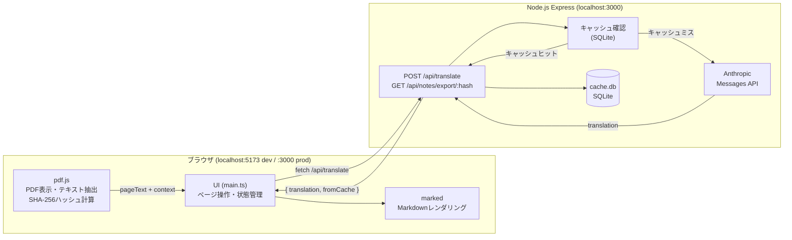

# アーキテクチャ概要 — 技術書翻訳ビューワー

## プロジェクト概要

英語の技術書をスムーズに読むためのローカルWebアプリ。  
PDF（左ペイン）とAI生成の日本語訳（右ペイン）を並べて表示し、開いたページをオンデマンドで翻訳・キャッシュする。

- **対象ユーザー**: 個人（Mac / Windows どちらでも動作）
- **コア価値**: 翻訳の手間をなくして読書の流れを保つ・蓄積された訳が読書ノートになる

---

## システム構成



**リクエストフロー:**
1. ユーザーがPDFを開く → ブラウザ内で SHA-256 を計算
2. 翻訳ボタン押下 → pdf.js でテキスト抽出（ヘッダー・フッター除去済み）
3. `POST /api/translate` でサーバーへ送信
4. サーバーがキャッシュを確認（ヒット → 即返却、ミス → Claude API 呼び出し）
5. 翻訳結果をSQLiteに保存し、ブラウザへ返す
6. ブラウザが Markdown をレンダリングして右ペインに表示

---

## ディレクトリ構成

```
translate-pdf-viewer-with-ai/
├── src/
│   ├── server/
│   │   ├── index.ts            # Express エントリーポイント（ポート3000）
│   │   ├── db.ts               # SQLiteシングルトン・キャッシュ読み書き
│   │   ├── routes/
│   │   │   ├── translate.ts    # POST /api/translate（翻訳+キャッシュ）
│   │   │   └── notes.ts        # GET /api/notes/export/:pdfHash（ノート出力）
│   │   └── services/
│   │       ├── claude.ts       # Anthropic SDK ラッパー・プロンプト定義
│   │       └── textClean.ts    # テキスト正規化（改行・空白処理）
│   └── client/
│       ├── index.html          # アプリ本体HTML
│       ├── main.ts             # DOM配線・状態管理（イベントハンドラ）
│       ├── pdfViewer.ts        # pdf.js統合・SHA-256・テキスト抽出・ノイズ除去
│       ├── translator.ts       # APIクライアント・Markdownレンダリング・ノート出力
│       └── styles.css          # UI スタイル（2ペインレイアウト）
├── docs/
│   └── ARCHITECTURE.md         # このドキュメント
├── data/                       # ランタイム生成（.gitignore）
│   └── cache.db                # SQLite キャッシュDB
├── dist/                       # ビルド成果物（.gitignore）
├── package.json
├── tsconfig.json               # フロントエンド用（Vite / ESNext）
├── tsconfig.server.json        # バックエンド用（CommonJS / Node）
├── vite.config.ts              # Viteビルド設定・開発プロキシ
├── .env.example                # 環境変数テンプレート
├── start.sh                    # 本番起動スクリプト（Mac/Linux）
└── start.bat                   # 本番起動スクリプト（Windows）
```

---

## 技術スタック選定理由

| 技術 | 選定理由 |
|---|---|
| **Node.js + Express** | TypeScript で Mac / Windows 両対応。プラットフォーム別バイナリビルドが不要で、管理者権限なしで社用PCに展開できる |
| **pdf.js** | ブラウザネイティブで動作。サーバーへのPDFバイナリ送信不要。テキストアイテムの座標情報（ノイズ除去に使用）も取得できる |
| **better-sqlite3** | 同期API。ローカル単一ユーザー用途でロック・並行性の心配がなく、コードが単純になる |
| **Claude Agent SDK** (`@anthropic-ai/claude-agent-sdk`) | ProプランのAgent SDKクレジット（月$20）を活用。`CLAUDE_CODE_OAUTH_TOKEN` で認証するため別途APIキー不要 |
| **Vite** | TypeScript フロントエンドのビルドと開発HMRを簡潔に提供。pdf.js workerのURL解決も自動 |
| **marked** | 軽量で依存なし。翻訳テキストのMarkdownをHTML変換するのに十分 |

---

## キャッシュ設計

### キャッシュキーの構造

```
(pdf_hash, page_num, prompt_ver)
```

| 要素 | 理由 |
|---|---|
| `pdf_hash` | ファイル名ではなくコンテンツのSHA-256。リネームや同名異本でのキャッシュ誤ヒットを防ぐ |
| `page_num` | ページ単位でキャッシュ。未翻訳ページには呼ばない（オンデマンド） |
| `prompt_ver` | プロンプトを改善したとき古い訳が返るのを防ぐ。定数 `'v1'` をインクリメントすると全キャッシュが無効化される |

### 動作フロー

```
翻訳リクエスト
    │
    ▼
キャッシュ確認 ──ヒット──→ 即時返却（fromCache: true）
    │
  ミス
    │
    ▼
Claude API 呼び出し
    │
    ▼
SQLite に INSERT OR REPLACE
    │
    ▼
返却（fromCache: false）
```

`INSERT OR REPLACE` により、強制再翻訳時も新しい結果で上書きされる。

---

## ノイズ除去アルゴリズム

pdf.js の `getTextContent()` が返す各テキストアイテムには `transform[5]` として **PDF座標系でのy位置**（ページ下端が原点）が含まれる。

```
ページ上端
│  ← y ≥ pageHeight × (1 - 0.07) の領域は除外（ヘッダー）
│
│  ← 有効テキスト領域
│
│  ← y ≤ pageHeight × 0.07 の領域は除外（フッター）
ページ下端（y=0）
```

**閾値 7%** は一般的な技術書のマージン比率に合わせたデフォルト値。`MARGIN_THRESHOLD` 定数（`pdfViewer.ts`）を調整することで変更可能。

---

## セットアップ手順

### 前提条件

- Node.js 18 以上
- `npm`
- Claude Code CLI インストール済み（`npm install -g @anthropic-ai/claude-code`）
- Claude Pro / Max / Team / Enterprise サブスクリプション

### インストールと起動

```bash
# 1. リポジトリをクローン
git clone <repository-url>
cd translate-pdf-viewer-with-ai

# 2. OAuth トークンを生成（初回のみ・1年間有効）
claude setup-token
# → 表示されたトークンをコピー

# 3. 環境変数の設定
cp .env.example .env
# .env を編集して CLAUDE_CODE_OAUTH_TOKEN にトークンをペースト

# 4. 依存パッケージをインストール
npm install

# 5a. 開発モードで起動（HMR 有効）
npm run dev
# → http://localhost:5173 を開く

# 5b. 本番ビルドして起動
npm run build
npm start
# → http://localhost:3000 を開く
```

**Windows の場合**: `start.bat` をダブルクリックで本番起動（ステップ 3 の `.env` 設定は事前に必要）。

---

## API リファレンス

### `POST /api/translate`

翻訳をリクエストする。キャッシュヒット時はAPIを呼ばない。

**Request Body:**

```json
{
  "pdfHash": "string (64文字の16進数, PDF内容のSHA-256)",
  "pageNum": "number (1-indexed)",
  "pageText": "string (翻訳対象ページのテキスト)",
  "contextBefore": "string (前ページ末尾数行, 省略可)",
  "contextAfter": "string (次ページ冒頭数行, 省略可)"
}
```

**Response (200):**

```json
{
  "translation": "string (Markdown形式の日本語訳)",
  "fromCache": "boolean",
  "pageNum": "number"
}
```

**Error Responses:**
- `400` — バリデーションエラー（`{ "error": "..." }`）
- `502` — Claude API エラー（`{ "error": "...", "detail": "..." }`）

---

### `GET /api/notes/export/:pdfHash`

指定PDFの全翻訳をMarkdownファイルとしてダウンロードする。

**Path Parameter:** `pdfHash` — 64文字の16進数

**Response (200):** `Content-Type: text/markdown; charset=utf-8`

ファイル内容の形式:
```markdown
# 読書ノート

生成日: 2026-05-25
PDF: `abc12345...`
ページ数: 42ページ分

---

## Page 1

（翻訳テキスト）

---

## Page 2
...
```

**Error Responses:**
- `400` — 無効なpdfHash
- `404` — このPDFの翻訳が存在しない

---

## コスト設計

| 設計 | 効果 |
|---|---|
| **オンデマンド翻訳** | 表示していないページはAPIを一切呼ばない |
| **SQLiteキャッシュ** | 同じページの2回目以降はゼロコスト |
| **ページ単位処理** | 1リクエストあたり約$0.027（約4円）|

Claude Sonnet 4.6（$3/1M入力トークン、$15/1M出力トークン）での試算:
- 1冊（約350ページ）≈ $9.5
- 月$20クレジット枠で約2冊分

---

## 拡張ポイント（MVP後）

### 候補1: テキスト選択によるピンポイント解説

選択した語句・文章を渡して翻訳ではなく「解説」を生成する。実装コストは翻訳とほぼ同じ（同じMessages APIに別プロンプトを渡すだけ）。

**実装イメージ:**
```typescript
// translator.ts に追加
export async function requestExplanation(
  selectedText: string,
  contextText: string
): Promise<string> { ... }
```

### 候補2: モデル使い分け

本文翻訳は Haiku 4.5（安価）、難解な章のみ Sonnet に切り替えるUI追加でコスト削減。

### 候補3: Batch API 対応

現在開いているページは通常API（即時）、先読みページはBatch API（50%割引・非同期）のハイブリッド。
